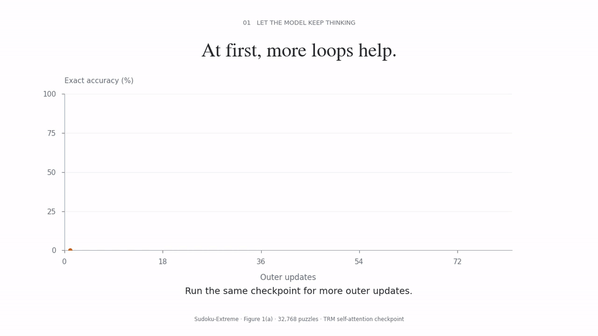
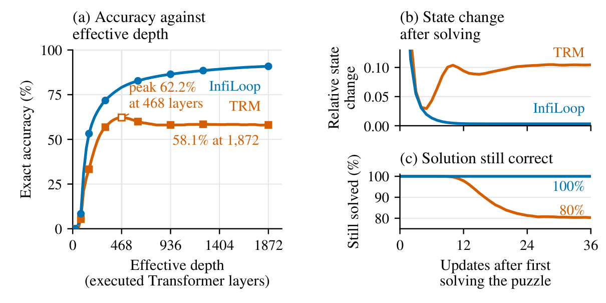
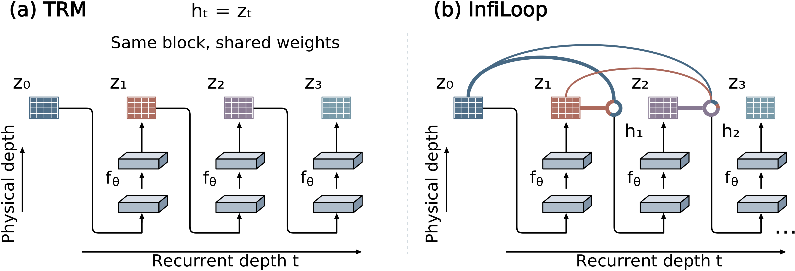
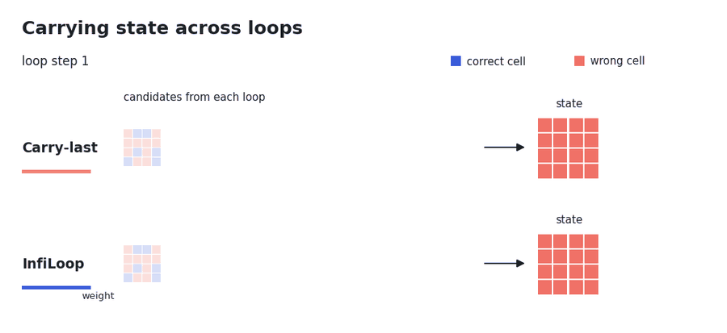
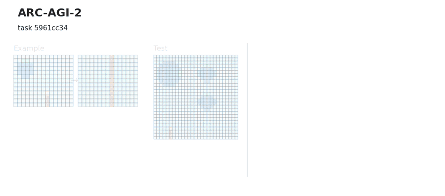
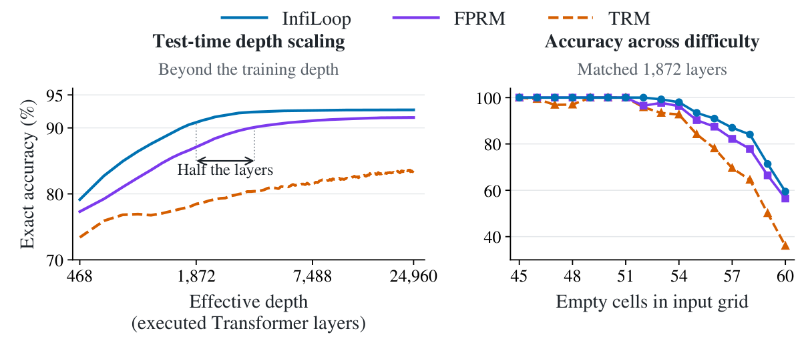

<div align="center">

# Scaling to Tens of Thousands of Test-Time Iterations with Loop-Native Attention Residuals

**Pengxiang Li**<sup>1</sup>, **Dilxat Muhtar**<sup>2</sup>, **Di He**<sup>3</sup>, **Guinan Su**<sup>4,5,6</sup>, **Lu Yin**<sup>7</sup>, **Shiwei Liu**<sup>4,5,6,†</sup>

<sup>1</sup>The Hong Kong Polytechnic University, <sup>2</sup>Independent Researcher,
<sup>3</sup>Shenzhen Institutes of Advanced Technology, Chinese Academy of Sciences,
<sup>4</sup>ELLIS Institute Tübingen, <sup>5</sup>Max Planck Institute for Intelligent Systems,
<sup>6</sup>Tübingen AI Center, <sup>7</sup>Shenzhen University of Advanced Technology

<sup>†</sup>Corresponding author: sliu@tue.ellis.eu

[](#)
[](#code)

</div>

<p align="center">
  
</p>

**InfiLoop** is a loop-native residual connection for looped Transformers.
Instead of passing only the latest block output to the next iteration (the *carry-last* rule), InfiLoop keeps a running, attention-weighted summary of all past recurrent states.
A 7M-parameter InfiLoop model reaches **97.9%** exact accuracy on Sudoku-Extreme and **13.6%** pass@2 on ARC-AGI-2, and on Sudoku-Extreme it keeps improving beyond **20,000** effective steps of test-time looping.

## Abstract

In this paper, we argue that looped Transformers need their own residual connections to prevent performance degradation as the number of iterations grows. We observe that increasing loop iterations can reduce reasoning accuracy: noisy state updates overwrite correct intermediate deductions and even undo completed solutions. This leaves subsequent iterations to recover lost information from an already degraded representation: once an error arises in an earlier loop, often as a result of long-range propagation through the recurrence, later loops find it difficult to correct. In this paper, we introduce InfiLoop, a loop-native residual connection that learns which past computations to retain and how much to accept from each new update. InfiLoop combines content-based weighting with learned temporal decay to maintain a running summary of recurrent states. An exact streaming recurrence keeps its persistent aggregation memory constant as the loop count grows. The resulting adaptive update suppresses unreliable proposals and preserves useful intermediate states. Across extensive reasoning tasks, a 7M-parameter InfiLoop model outperforms existing recursive architectures, reaching 97.9% exact accuracy on Sudoku-Extreme, and 13.6% pass@2 on ARC-AGI-2. Notably, on Sudoku-Extreme, InfiLoop continues to improve with test-time looping beyond 20,000 effective steps, showing that added depth translates directly into stronger reasoning.

## Why carry-last fails at depth

<p align="center">
  
</p>

On Sudoku-Extreme, TRM (carry-last) peaks at 62.2% after 468 executed layers and falls to 58.1% at 1,872 layers.
After a puzzle is solved, its state keeps changing, and solved puzzles are lost again.
InfiLoop keeps improving over the same depth and reaches 90.9%, and every puzzle it solves remains solved 36 updates later.

## Method

<p align="center">
  
</p>

A shared block $f_\theta$ produces a candidate state $z_t$ at every loop step.
InfiLoop scores each candidate by content, $s_t = q^\top \mathrm{RMSNorm}(z_t)$, and decays older candidates by a learned factor $\beta \in (0,1)$.
The recurrent state is the normalized weighted sum $h_t = N_t / D_t$, computed by an exact streaming recurrence:

$$
N_t = \beta N_{t-1} + e_t z_t, \qquad D_t = \beta D_{t-1} + e_t, \qquad e_t = \exp(s_t).
$$

The persistent memory is one $d$-dimensional vector and one scalar per token, independent of the number of loops.
The same update can be written as an adaptive residual step:

$$
h_t = h_{t-1} + \gamma_t (z_t - h_{t-1}), \qquad \gamma_t = \frac{e_t}{\beta D_{t-1} + e_t} \in (0, 1).
$$

A high-scoring candidate moves the state toward it; a low-scoring candidate leaves the previous state almost unchanged.

<p align="center">
  
</p>

Schematic with illustrative numbers: the same stream of candidates is solved at step 5 and noisy at steps 6 and 8. Carry-last copies each noisy candidate into the state; InfiLoop gives them a small step size and keeps the solution.

## Results

Exact accuracy (%) on Sudoku-Extreme and Maze-Hard, pass@2 (%) on ARC-AGI. Best results are **bold**; the best among 7M-parameter models are <u>underlined</u>.

| Method | Params | Sudoku-Extreme | Maze-Hard | ARC-AGI-1 | ARC-AGI-2 |
|---|---|---|---|---|---|
| *Large language models* | | | | | |
| DeepSeek R1 | 671B | 0.0 | 0.0 | 15.8 | 1.3 |
| Claude 3.7 Sonnet | – | 0.0 | 0.0 | 28.6 | 0.7 |
| o3-mini-high | – | 0.0 | 0.0 | 34.5 | 3.0 |
| Gemini 2.5 Pro (32K) | – | – | – | 37.0 | 4.9 |
| *Reproduced by us* | | | | | |
| TRM<sup>†</sup> | 7M | 73.6 | – | – | 4.6 |
| *Recursive reasoning models (reported)* | | | | | |
| HRM | 27M | 55.0 | 74.5 | 40.3 | 5.0 |
| Attractor Model | 27M | 91.4 | **93.1** | – | – |
| URM | 14M | 77.6 | – | **≥53.8**<sup>‡</sup> | **≥16.0**<sup>‡</sup> |
| TRM | 7M | 74.7 | 85.3 | 44.6 | 7.8 |
| EqR | 7M | 93.0 | – | – | – |
| Attractor Model | 7M | 54.3 | 46.7 | – | – |
| FPRM | 7M | 94.2 | 87.0 | 47.5 | 6.2 |
| **InfiLoop (ours)** | 7M | **<u>97.9</u>** | <u>87.4</u> | <u>49.1</u> | <u>13.6</u> |

<sup>†</sup>TRM retrained on Sudoku-Extreme with the authors' published recipe, and the released ARC-AGI-2 verification checkpoint evaluated under our protocol.
<sup>‡</sup>URM reports ARC pass@1.
LLM results follow Jolicoeur-Martineau (2025); URM and EqR parameter counts follow Movahedi et al. (2026).

### ARC-AGI-2 examples

<p align="center">
  
</p>

Two held-out ARC-AGI-2 evaluation tasks (best of two attempts, as in the paper). InfiLoop matches the target exactly; TRM makes 30 and 14 cell errors.

### Test-time depth scaling

<p align="center">
  
</p>

Evaluated up to 24,960 executed layers, InfiLoop reaches 90.9% at 1,872 layers, higher than FPRM's 90.1% at 3,744 layers, with half the layer evaluations.

## Code

The animations above are generated from the paper's figure data by `tools/animations/teaching.py` and `tools/animations/arc.py`; the schematic is `tools/animations/mech.py`.

Training and evaluation code will be released in this repository.

## Citation

```bibtex
@article{li2026infiloop,
  title   = {Scaling to Tens of Thousands of Test-Time Iterations with Loop-Native Attention Residuals},
  author  = {Li, Pengxiang and Muhtar, Dilxat and He, Di and Su, Guinan and Yin, Lu and Liu, Shiwei},
  journal = {arXiv preprint},
  year    = {2026}
}
```
